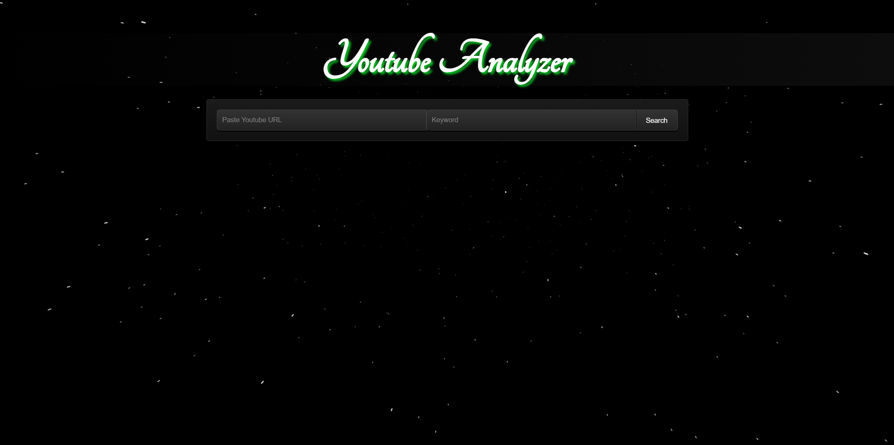

# youtube video comment analysis
- this project will fetch the commnts from youtube video and give the comments that match your keyword

# Requirements.txt
> Run requirements.txt file to install module 
`pip install -r requirements.txt`

# start server
> open terminal and run the below command 
`py manage.py runserver` 
> open http://127.0.0.1:8000/  
> Project run successfully

>how project looks like

<video width="320" height="240" controls>
  <source src="./PROJECT_SAMPLE.mp4" type="video/mp4">
  Your browser does not support the video tag.
</video>

